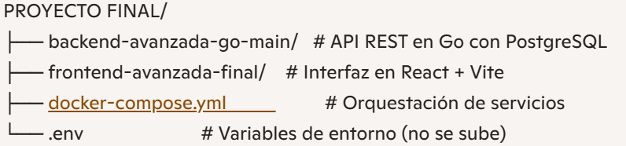

# Proyecto Final: Gestión de Misiones y Alquimistas 🧪⚔️

Este proyecto integra un **backend en Go** y un **frontend en React (Vite)**, orquestados con **Docker Compose**.  
Permite gestionar alquimistas, misiones y supervisores, con autenticación y protección de rutas.

---

## 📂 Estructura del proyecto


---

## 🚀 Instalación y ejecución

1. Clona el repositorio:
   ```bash
   git clone https://github.com/Sergio1509/Proyecto-Final-Avanzada.git
   cd Proyecto-Final-Avanzada

2. Configura las variables en `.env`:

```env
POSTGRES_HOST=postgres  
POSTGRES_DB=proyecto  
POSTGRES_USER=admin  
POSTGRES_PASSWORD=secret  
VITE_API_URL=http://app:8000  


3. Levanta los servicios con Docker:

docker-compose up --build

4. Accede a:

Frontend → http://localhost:5173
Backend → http://localhost:8000

🔐 Login de prueba

"username": "almaquinista",
"password": "1234"

🛠️ Tecnologías
    Go 1.24
    React + Vite
    PostgreSQL 18
    Docker Compose

📦 Endpoints principales
    POST /login → Autenticación
    GET /alquimistas → Listado protegido
    GET /misiones → Listado protegido

